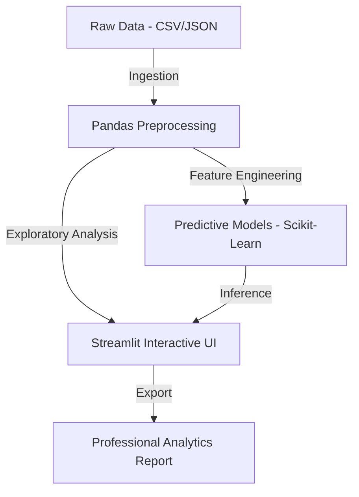

# 📊 Kirov DataLab: Enterprise Analytics & ML Platform

*The central intelligence hub for data engineering, predictive modeling, and strategic insights.*

---

## 🏛️ Platform Architecture

Kirov DataLab is designed as a modular analytics workbench, enabling rapid ingestion, processing, and visualization of complex datasets.

## 🚀 Key Capabilities

| Capability | Sentinel Feature | Tech Stack |
| :--- | :--- | :--- |
| **Auto-Insights** | Automated trend detection & anomaly identification. | Pandas / NumPy |
| **Predictive Modeling** | Real-time classification and regression engines. | Scikit-Learn |
| **Geospatial Mapping** | Dynamic mapping of regional data (e.g., Gauteng). | Plotly / Folium |
| **Export Reporting** | High-fidelity PDF generation for stakeholders. | ReportLab / Matplotlib |

## 🛠️ Integrated ML Engines

DataLab includes purpose-built engines for the African context:

- **Economic Forecaster**: Time-series analysis for regional market trends.
- **Logistics Optimizer**: Neural routing simulations for township economies.
- **Anomaly Detection**: IsolationForest-driven outlier identification in financial data.

## 🚦 Deployment

Kirov DataLab is optimized for high-visibility deployments:

- **Cloud Hosting**: Streamlit Cloud (Free Tier)
- **R&D Environment**: Jupyter Lab / Google Colab
- **CI/CD**: GitHub Actions for automated linting and smoke-testing.

---
© 2026 Kirov Dynamics Technology · Engineering the Data-Driven Future.
