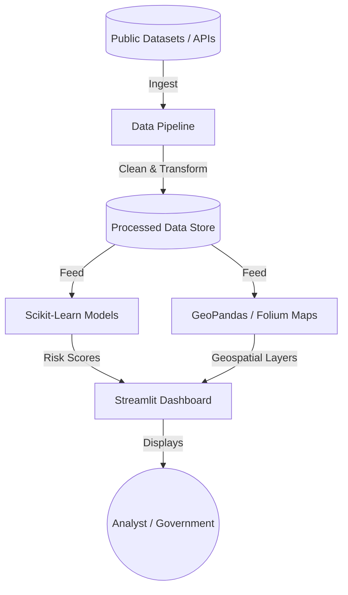

# 📊 Kirov DataLab — Sovereign Data Engineering Platform

> **Future Project · Seeking Contributors & Funding**


[](https://github.com/Raphasha27/kirov-datalab)
[](./LICENSE)

---

## 🚀 Vision

**Kirov DataLab** is a sovereign data engineering and AI analytics platform purpose-built for the African context. It processes public and private datasets to generate geospatial intelligence, economic risk maps, and population-level insights that empower governments, NGOs, and enterprises to make evidence-based decisions.

This project is **actively developed** and **open to data scientists, engineers, and investors** who understand the transformative power of clean, sovereign data infrastructure.

---

## 🧠 What It Does

| Feature | Description |
| :--- | :--- |
| **Geospatial Mapping** | Interactive choropleth maps of Gauteng and SADC regions using Plotly |
| **Economic Risk Scoring** | IsolationForest anomaly detection on economic indicators |
| **Data Pipeline** | Automated ingestion, cleaning, and transformation of public datasets |
| **AI Forecasting** | Time-series models for population, resource, and demand forecasting |
| **Interactive Dashboard** | Streamlit-powered analytical interface with real-time filtering |

---

## 🛠️ Tech Stack

| Layer | Technology |
| :--- | :--- |
| **Analytics UI** | Streamlit, Plotly Express, Folium |
| **Data Engineering** | Python, Pandas, NumPy, GeoPandas |
| **Machine Learning** | Scikit-Learn (IsolationForest, RandomForest) |
| **Geospatial** | Folium, Shapely, GeoJSON |
| **CI/CD** | GitHub Actions (CodeQL, CI, Secret Scan) |
| **Planned Deployment** | Streamlit Cloud (free tier, no billing risk) |

> ⚠️ **Deployment Note:** Not yet deployed. When ready, this will be hosted on **Streamlit Cloud** — which has a generous free tier with zero billing risk. No Docker or cloud compute required.

---

## 🏗️ Architecture



---

## 🧪 How to Run Locally

```bash
# 1. Clone the repository
git clone https://github.com/Raphasha27/kirov-datalab.git
cd kirov-datalab

# 2. Create a virtual environment
python -m venv venv
venv\Scripts\activate   # Windows
# source venv/bin/activate  # macOS/Linux

# 3. Install dependencies
pip install -r requirements.txt

# 4. Run the Streamlit dashboard
streamlit run app.py
# Opens automatically at http://localhost:8501

# 5. Run data pipeline separately (optional)
python pipeline/ingest.py
```

---

## 🤝 Contributing

We need people who care about African data sovereignty:

- 📊 **Data Scientists** — Improve forecasting and anomaly detection models
- 🗺️ **GIS Engineers** — Expand geospatial coverage across SADC
- 🐍 **Python Developers** — Optimize the data ingestion pipeline
- 📝 **Domain Experts** — Public health, agriculture, urban planning data

---

## 💡 Funding & Collaboration

> Kirov DataLab is the analytical backbone of **Kirov Dynamics Technology**.
> We are seeking partnerships with research institutions, government agencies, and impact investors who want to fund evidence-based African decision-making infrastructure.
>
> Contact: [Kirov Dynamics Portfolio](https://portfolio-react-zeta-black-48.vercel.app/)

---


