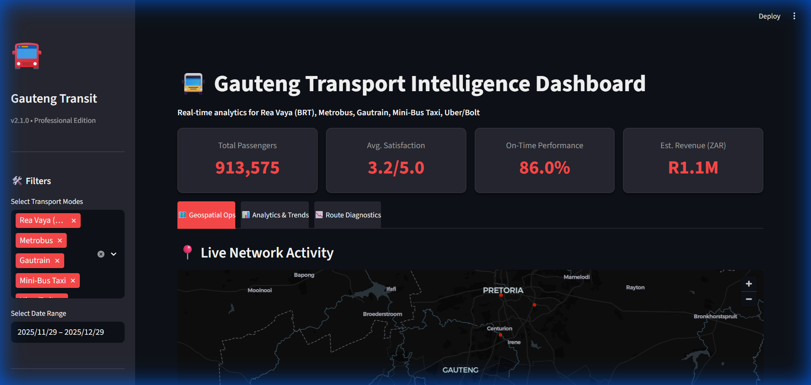

# 🚍 Gauteng Transport Intelligence Dashboard



A professional-grade, real-time analytics dashboard for monitoring and managing public transport systems (Metrobus, Gautrain, BRT, etc.) throughout Gauteng Province. Built with **Streamlit** and Python.

🔗 **Repository:** [Raphasha27/dashboard](https://github.com/Raphasha27/dashboard)

---

## 📌 Features

- **📍 Geospatial Intelligence**: 
  - Interactive map visualization of transport hubs and active routes.
  - Real-time heatmaps of passenger density at major stations.
- **📊 Operational Analytics**:
  - Live KPIs for passenger volume, on-time performance, and revenue.
  - Granular breakdown of satisfaction scores and efficiency metrics.
- **📉 Route Diagnostics**:
  - Automated identification of underperforming routes (low satisfaction/reliability).
  - Drill-down capabilities for root cause analysis.
- **🛠️ Realistic Simulations**:
  - Includes a built-in mock data engine to simulate 30 days of realistic transport activity across all major modes.
- **🤖 AI & Pro Features**:
  - **Smart Chatbot**: Natural language queries for network status and stats.
  - **Predictive Forecasting**: Machine learning projections for future passenger demand.
  - **Data Export**: One-click CSV download of filtered datasets.

---

## 🚀 Quick Start

### 1. Prerequisites
Ensure you have Python 3.8+ installed.

### 2. Installation
Clone the repository and install the dependencies:

```bash
pip install -r requirements.txt
```

### 3. Run the App
Launch the dashboard locally:

```bash
streamlit run gauteng_transport_dashboard.py
```

The app will open automatically in your browser at `http://localhost:8501`.

---

## 🛠️ Tech Stack
- **Frontend**: [Streamlit](https://streamlit.io/)
- **Data Handling**: Pandas, NumPy
- **Visualizations**: 
  - [Streamlit Map](https://docs.streamlit.io/library/api-reference/charts/st.map) (Geospatial)
  - [Plotly Express](https://plotly.com/python/plotly-express/) (Interactive Charts)
- **Deployment**: Ready for Streamlit Cloud

---

## 🤝 Contributing
Contributions are welcome! Please feel free to verify the status of the `dev` branch before making a pull request.

---

*© 2025 Gauteng Transport / NexusSys*
